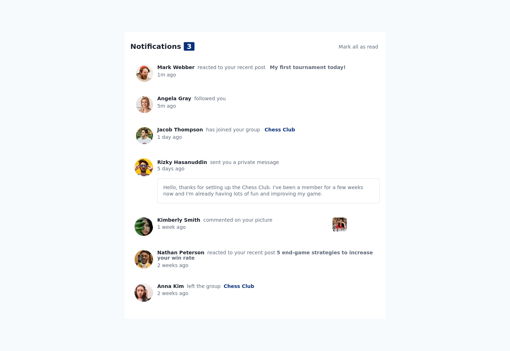

# Frontend Mentor - Notifications page solution

This is a solution to the [Notifications page challenge on Frontend Mentor](https://www.frontendmentor.io/challenges/notifications-page-DqK5QAmKbC). Frontend Mentor challenges help you improve your coding skills by building realistic projects.

## Table of contents

- [Overview](#overview)
  - [The challenge](#the-challenge)
  - [Screenshot](#screenshot)
  - [Links](#links)
- [My process](#my-process)
  - [Built with](#built-with)
  - [What I learned](#what-i-learned)
- [Author](#author)

## Overview
This is a design for a unique social media notifucation page component.
### The challenge

Users should be able to:

- Distinguish between "unread" and "read" notifications
- Select "Mark all as read" to toggle the visual state of the unread notifications and set the number of unread messages to zero
- View the optimal layout for the interface depending on their device's screen size
- See hover and focus states for all interactive elements on the page

### Screenshot

### Links

- Solution URL: [solution URL](https://github.com/abdullahmuslim/notification-page-component)
- Live Site URL: [live site](https://abdullahmuslim.github.com/notification-page-component)

## My process
First come proper planning of how the layout should go.
The designs are very similar since the main content's width only need to keep increasing until it gets to a point where it just remains centered as the viewport's width increases.

### Built with

- Semantic HTML5 markup
- CSS custom properties
- Flexbox
- CSS Grid
- Mobile-first workflow
- [Bootstrap 5.0.2](https://getbootstrap.com/) - For styles

### What I learned
In the process of developing, I got expose to more bootstrap utility classes.
Also, I begin to feel the spirit of good designing surging in me ^_^
Added sizing and hover effect with css, relying on bootstrap for the layout.
## Author

- Website - [Abdullah Muslim](https://abdullahmuslim.github.io/portfolio)
- Frontend Mentor - [@abdullahmuslim](https://www.frontendmentor.io/profile/abdullahmuslim)
